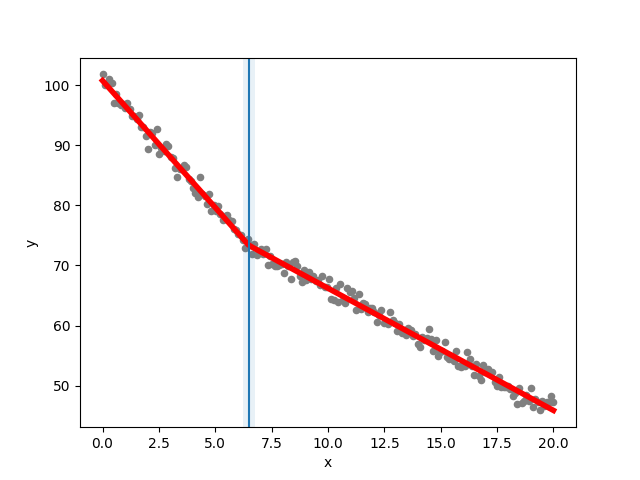

# breakpoint-regression

Breakpoint (aka segmented) regression in Python. Simultaneously find breakpoints and straightline segments between those breakpoints. Based on Muggeo "Estimating regression models with unknown break-points" (2003)

## Installation

You can install piecewise-regression from [PyPI](https://pypi.org/project/breakpoint-regression/):

    pip install piecewise-regression

The package is supported on Python 3.7 and above.

## How To Use

The package requires some x and y data to fit. You also need to specify either a) some initial breakpoint guesses as `start_values` or b) how many breakpoints you want to fit as `n_breakpoints`

	import piecewise_regression
	import numpy as np

	# Generate some test data with 1 breakpoint
    alpha_1 = -4
    alpha_2 = -2
    intercept = 100
    breakpoint_1 = 7
    n_points = 200
    np.random.seed(0)

    xx = np.linspace(0, 20, n_points)
    yy = intercept + alpha_1*xx + (alpha_2-alpha_1) * np.maximum(xx - breakpoint_1, 0) + np.random.normal(size=n_points)

    # Given some data, fit the model
    bp_fit = Fit(xx, yy, start_values=[5], n_breakpoints=1)

    # Print a summary of the fit
    bp_fit.summary()

Example output:

	                    Breakpoint Regression Results                     
	====================================================================================================
	No. Observations                      200
	No. Model Parameters                    4
	Degrees of Freedom                    196
	Res. Sum of Squares               193.264
	Total Sum of Squares              46201.8
	R Squared                        0.995817
	Adjusted R Squared               0.995731
	Converged:                           True
	====================================================================================================
	====================================================================================================
	                    Estimate      Std Err            t        P>|t|       [0.025       0.975]
	----------------------------------------------------------------------------------------------------
	const                100.726        0.244       413.63     3.1e-290       100.25       101.21
	alpha1              -4.21998       0.0653      -64.605    4.37e-134      -4.3488      -4.0912
	beta1                2.18914       0.0689       31.788            -       2.0533        2.325
	breakpoint1          6.48706        0.137            -            -       6.2168       6.7573
	----------------------------------------------------------------------------------------------------
	These alphas(gradients of segments) are estimated from betas(change in gradient)
	----------------------------------------------------------------------------------------------------
	alpha2              -2.03084       0.0218      -93.068    3.66e-164      -2.0739      -1.9878
	====================================================================================================

	Davies test for existence of at least 1 breakpoint: p=5.13032e-295 (e.g. p<0.05 means reject null hypothesis of no breakpoints at 5% significance)

There are also tools for plotting data

	import matplotlib.pyplot as plt

	# Plot the data, fit, breakpoints and confidence intervals
    bp_fit.plot_data(color="grey", s=20)
    # Pass in standard matplotlib keywords to control any of the plots
    bp_fit.plot_fit(color="red", linewidth=4) 
    bp_fit.plot_breakpoints()
    bp_fit.plot_breakpoint_confidence_intervals()
    plt.xlabel("x")
    plt.ylabel("y")
    plt.show()
    plt.close()

## Testing

From the main dierctory run 
	
	python3 -m "nose"

Note: This requires nosetests, can be downloaded from apt with

	sudo apt install python3-nose
