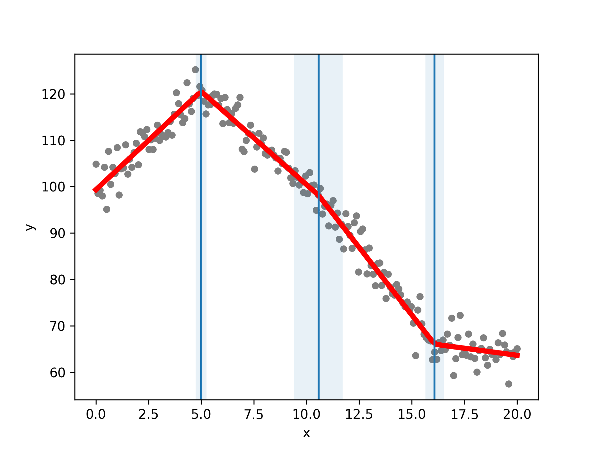

# Summary

Piecewise regression (also known as segmented regression, broken-line regression or breakpoint analysis) fits continuous straight lines to data with one or more breakpoints where the gradient changes. The approach here is as described by Muggeo [@muggeo2003estimating], where the breakpoint positions and the straight line models are simultaneously fit using an iterative method. The package includes comprehensive statistical analysis that gives confidence intervals for all model variables, and hypothesis testing for the existence of breakpoints. 

# Statement of need

A common problem is to fit a linear regression model that includes some change(s) in gradient. One approach would be numerical minimisation of the sum of squared errors via a grid search for the breakpoint position(s). Muggeo [@muggeo2003estimating] derived an altearnative method to grid search, with the advantages of being more computationally efficient and allowing for more robust statistical analysis. There are many R packages that implement this method including the segmented R package written by Muggeo himself [@muggeo2008segmented]. However, at the time of writing there are not comparable resources in Python.  

# Examples

An example fit is shown in \autoref{fig:example}. 

# How It Works

It is not necessary to know the underlying mathematics to use the package. We follow here the derivation by Muggeo [@muggeo2003estimating]. The general form of the model with one breakpoint is

\begin{equation}
    y = \alpha x + c + \beta (x-\psi) H(x-\psi) + \zeta \,,
\end{equation}

where given some data, $x$, $y$, we are trying to estimate the gradient of the first segment, $\alpha$, the intercept of the first segment, $c$, the change in gradient from the first to second segments, $\beta$, and the breakpoint position, $\psi$. $H$ is the Heaviside step function and $\zeta$ is a noise term. This cannot be solved directly through linear regression as the relationship is non-linear. We can take a linear approximation by a Taylor expansion around some initial guess for the breakpoint, $\psi^{(0)}$, 

\begin{equation}
    y \approx \alpha x + c + \beta (x - \psi^{(0)}) H (x - \psi^{(0)}) - \beta (\psi - \psi^{(0)}) H(x - \psi^{(0)}) + \zeta \,.
\end{equation}

This is a linear relationship and we can find a new breakpoint estimate, $\psi^{(1)}$, through linear regression. We iterate in this way until the breakpoint estimate converges, at which point we stop the algorithm. The same method is used with multiple breakpoints, taking a multivarite Taylor expansion around initial guesses for each of the breakpoints. 

Muggeo's iterative algorithm is not guaranteed to converge on a globally optimal solution. Instead, it can converge to local optima or diverge. To address this limitation we also implement bootstrap restarting [wood2001minimizing], again following Muggeo's approach [@muggeo2008segmented]. The bootstrap restarting algorihtm generates a non-parametric bootstrap of the data through resampling, which is then used to find new breakpoint values that may be a better global solution.

# Features

The package includes the following features:

- Standard fit using the iterative method described by Muggeo.  
- Bootstrap restarting to avoid local minima. 
- Bootstrap restarting with randomised initial breakpoint guesses. 
- Calculation of Standard Errors and confidence intervals.
- Davies hypothesis test for the existence of a breakpoint. 
- Customisable plots of fits.
- Customisable plots of algorithm iterations.
- Printable summary.
- Summary data output.
- Comprehensive tests.
- Model comparision with an unknown number of breakpoints, with the best fit based on the Bayesian Information Criterion.  

The package can be downloaded through the [Python Package Index](https://pypi.org/project/piecewise-regression/). The full code is publicly available on [github](https://github.com/chasmani/piecewise-regression). Documentation, including an API reference, can be found at [Read The Docs](https://piecewise-regression.readthedocs.io/en/latest/).

# Acknowledgements

I acknowledge support from Thomas Hills. The work was funded by the EPSRC grant for the Mathematics for Real-World Systems CDT at Warwick (grant number EP/L015374/1)

# References